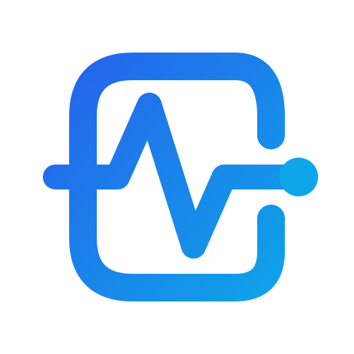

<p align="center">
  <a href="https://iaes.dev">
    
  </a>
</p>

# IAES — Industrial Asset Event Standard

> A vendor-neutral event format for industrial asset measurements, diagnoses, and maintenance intents.

[](https://doi.org/10.5281/zenodo.18973217)
[](https://pypi.org/project/iaes/)
[](https://www.npmjs.com/package/@iaes/sdk)
[](https://flows.nodered.org/node/node-red-contrib-iaes)
[](https://creativecommons.org/licenses/by/4.0/)
[](https://www.researchgate.net/publication/402029169)
[](https://www.researchgate.net/publication/402029656)

Industrial systems speak different languages. A vibration sensor outputs raw waveforms. An AI model outputs health scores. SAP expects maintenance notifications. PI System expects tag values. MaintainX expects user variables.

IAES provides the **neutral layer in between** — one event format that any producer can emit and any consumer can understand.

```
Sensors --> Intelligence --> IAES --> Connectors --> Enterprise Systems
```

## Part of IAES

The standard ships as four packages that version together. **The first two
numbers of a package version are the specification it implements** — `2.0.x`
implements IAES 2.0.

| Runtime | Package | Install |
|---|---|---|
| TypeScript / JavaScript | `@iaes/sdk` | `npm install @iaes/sdk` |
| Python | `iaes` | `pip install iaes` |
| Node-RED | `node-red-contrib-iaes` | `npm install node-red-contrib-iaes` |
| n8n | `n8n-nodes-iaes` | `npm install n8n-nodes-iaes` |

Specification, JSON Schemas and governance: **[iaes.dev](https://iaes.dev)**.

## Install

```bash
pip install iaes                      # Python
npm install @iaes/sdk                 # TypeScript / Node.js
npm install node-red-contrib-iaes     # Node-RED
```

## Publish Events

The SDK includes a `Client` that sends IAES events to any compliant endpoint via HTTPS.

**Python:**

```python
from iaes import Client, AssetMeasurement

client = Client("https://your-endpoint.example.com", api_key="your-key")
event = AssetMeasurement(
    asset_id="MOTOR-001",
    measurement_type="vibration_velocity",
    value=4.2,
    unit="mm/s",
    source="acme.sensors.plant1",
)
result = client.publish(event)
```

**TypeScript:**

```ts
import { IaesClient, AssetMeasurement } from "@iaes/sdk";

const client = new IaesClient("https://your-endpoint.example.com", {
  apiKey: "your-key",
});
const event = new AssetMeasurement({
  asset_id: "MOTOR-001",
  measurement_type: "vibration_velocity",
  value: 4.2,
  unit: "mm/s",
  source: "acme.sensors.plant1",
});
const result = await client.publish(event);
```

The endpoint URL is any IAES-compliant receiver — your own backend, a cloud broker, or a third-party integration.

## Examples

### Vibration measurement

```python
from iaes import AssetMeasurement

event = AssetMeasurement(
    asset_id="MOTOR-001",
    measurement_type="vibration_velocity",
    value=4.2,
    unit="mm/s",
    source="acme.sensors.plant1",
    units_qualifier="rms",           # ISO 17359
    sampling_rate_hz=25600,
)
payload = event.to_dict()  # IAES wire format, ready for json.dumps()
```

```typescript
import { AssetMeasurement } from "@iaes/sdk"

const event = new AssetMeasurement({
  asset_id: "MOTOR-001",
  measurement_type: "vibration_velocity",
  value: 4.2,
  unit: "mm/s",
  source: "acme.sensors.plant1",
  units_qualifier: "rms",
  sampling_rate_hz: 25600,
})
const payload = JSON.stringify(event)  // toJSON() called automatically
```

### Energy / power quality

```python
from iaes import AssetMeasurement

pf_event = AssetMeasurement(
    asset_id="SUBSTATION-A",
    measurement_type="power_factor",
    value=0.82,
    unit="ratio",
    source="ion8650.meter_01",
)

thd_event = AssetMeasurement(
    asset_id="SUBSTATION-A",
    measurement_type="thd_voltage",
    value=6.3,
    unit="%",
    source="ion8650.meter_01",
)
```

### AI health diagnosis

```python
from iaes import AssetHealth, Severity

event = AssetHealth(
    asset_id="MOTOR-001",
    health_index=0.16,
    severity=Severity.CRITICAL,
    failure_mode="bearing_inner_race",
    rul_days=5,
    recommended_action="Replace bearing immediately",
    source="ai.vibration_model",
    iso_13374_status="unacceptable",   # ISO 13374
    iso_14224={                         # ISO 14224
        "mechanism_code": "1.1",
        "cause_code": "1",
        "detection_method": "VIB",
    },
)
```

### Work order intent

```python
from iaes import WorkOrderIntent

event = WorkOrderIntent(
    asset_id="MOTOR-001",
    title="Replace bearing DE — AI diagnosis critical",
    priority="high",
    triggered_by="ai_diagnosis",
    recommended_due_days=3,
    source="ai.vibration_model",
    source_event_id="<health_event_id>",  # links to the diagnosis
)
```

### Maintenance completion

```python
from iaes import MaintenanceCompletion

event = MaintenanceCompletion(
    asset_id="MOTOR-001",
    work_order_id="WO-2026-0042",
    status="completed",
    actual_duration_seconds=7200,
    failure_confirmed=True,
    failure_mode="bearing_inner_race",
    source="cmms.sap_pm",
)
```

## Validate

```python
from iaes import validate, ValidationError

try:
    validate(event.to_dict())
    print("Valid IAES event")
except ValidationError as e:
    print(e)
```

Requires: `pip install iaes[validate]`

## Deserialize

```python
import json
from iaes import from_dict

# Any IAES envelope -> correct model instance
wire = json.loads(mqtt_message)
event = from_dict(wire)  # AssetMeasurement, AssetHealth, etc.
print(event.asset_id, event.value)
```

## Event Types (v2.0)

| Event Type | Python | TypeScript | Purpose |
|------------|--------|------------|---------|
| `asset.measurement` | `AssetMeasurement` | `AssetMeasurement` | Sensor reading (vibration, temperature, pressure, current, power factor, THD...) |
| `asset.health` | `AssetHealth` | `AssetHealth` | AI diagnosis or expert assessment (health index, fault, RUL) |
| `maintenance.work_order_intent` | `WorkOrderIntent` | `WorkOrderIntent` | Intent to create a work order |
| `maintenance.completion` | `MaintenanceCompletion` | `MaintenanceCompletion` | Work order completion acknowledgment |
| `asset.hierarchy` | `AssetHierarchy` | `AssetHierarchy` | Asset hierarchy sync (org > plant > area > equipment) |
| `sensor.registration` | `SensorRegistration` | `SensorRegistration` | Sensor discovery and lifecycle |
| `maintenance.spare_part_usage` | `SparePartUsage` | `SparePartUsage` | Spare parts consumed during maintenance |

## Enums

All enums accept either the enum constant or a plain string:

```python
AssetHealth(asset_id="M-001", severity=Severity.CRITICAL)
AssetHealth(asset_id="M-001", severity="critical")  # also works
```

| Enum | Values |
|------|--------|
| `Severity` | info, low, medium, high, critical |
| `MeasurementType` | vibration_velocity, vibration_acceleration, temperature, current, voltage, power, pressure, flow, speed, power_factor, thd_voltage, thd_current, frequency, ... |
| `UnitsQualifier` | rms, peak, peak_to_peak, average, true_rms |
| `ISO13374Status` | unknown, normal, satisfactory, unsatisfactory, unacceptable, imminent_failure, failed |
| `WorkOrderPriority` | low, medium, high, emergency |
| `CompletionStatus` | completed, partially_completed, cancelled, deferred |
| `HierarchyLevel` | organization, plant, area, equipment |
| `RelationshipType` | parent_of, child_of, sibling_of, depends_on |
| `RegistrationStatus` | discovered, registered, calibrated, decommissioned |

## Wire Format

Every event serializes to the same envelope structure:

```json
{
  "spec_version": "2.0",
  "dataschema": "https://iaes.dev/schema/v2/asset.measurement",
  "event_type": "asset.measurement",
  "event_id": "a9e3c4b2-...",
  "correlation_id": "3b2f9d8c-...",
  "timestamp": "2026-03-08T12:00:00+00:00",
  "source": "acme.sensors.plant1",
  "content_hash": "8a3f9c2e1b4d7e6f",
  "asset": {
    "asset_id": "MOTOR-001",
    "asset_name": "Motor Bomba P-101",
    "plant": "Planta Norte",
    "area": "Turbinas"
  },
  "data": {
    "measurement_type": "vibration_velocity",
    "value": 4.2,
    "unit": "mm/s",
    "units_qualifier": "rms",
    "sampling_rate_hz": 25600
  }
}
```

`dataschema` is the canonical URI of the schema the payload was written against — the SDKs derive it from `event_type` and omit it for a custom type that has no published schema.

`content_hash` is a 16-char SHA-256 prefix of the `data` payload, computed identically in Python and TypeScript for cross-language idempotency.

## Standards referenced

IAES cites industrial standards where they supply context or a vocabulary
defined outside it. **Citation is not conformance**, and IAES 2.0 claims none
to ISO 13374, ISO 17359, ISO 14224 or ISO 55000.

| Document | Relationship | Normative for meaning |
|---|---|---|
| **ISO 4217** | `currency` carries an ISO 4217 code | **Yes** — and the schema checks the shape, not the list |
| **ISO 14224** | Context. Named for the `iso_14224` object and Appendix B | No |
| **ISO 17359** | Context. Named for `units_qualifier` and the acquisition fields | No |
| **ISO 13374 series** | Historical context. The attributions on `iso_13374_status` and `condition_trend` were **withdrawn in 2.0**: the values are IAES's own vocabulary and the field names are kept for 1.x compatibility | No |
| **ISO 55000** | Context for asset management | No |

Earlier IAES material described a field-level mapping to those four documents.
IAES 2.0 withdrew that claim where the correspondence had not been verified
against the cited document. The full table, including what the schemas do and
do not enforce, is in `IAES_SPEC.md` under *References* — the specification
governs. All these fields are optional; 1.x events remain valid.

## Zero Dependencies

The core SDK uses only standard library. No runtime dependencies.

| | Core | Validation |
|-|------|------------|
| **Python** | stdlib only | `pip install iaes[validate]` adds `jsonschema` |
| **TypeScript** | Node.js `crypto` only | `ajv` optional |

## Cross-Language Compatibility

Both SDKs produce identical wire format and identical `content_hash` for the same data. Events created in Python validate in TypeScript and vice versa. This is tested on every commit.

### Reference scenarios

One industrial story, told four times: a vibration model reads 4.2 mm/s RMS on a motor, concludes a bearing's outer race is degrading, asks maintenance to inspect it, and a technician closes the loop. Each implementation produces the same five events -- **the workflow changes, the event meaning does not** -- and `tests/test_reference_scenarios.py` checks all four against a single fixture on every commit.

| Implementation | The scenario | Reach for it when |
|---|---|---|
| Python | [`scenarios/python/reference_scenarios.py`](scenarios/python/reference_scenarios.py) | the producer **is the model** |
| TypeScript | [`scenarios/typescript/reference-scenarios.ts`](scenarios/typescript/reference-scenarios.ts) | the producer is a **service** |
| Node-RED | [`scenarios/node-red/flow.json`](scenarios/node-red/flow.json) -- import it as-is | the reading is already on the wire, at the **OT boundary** |
| n8n | [`scenarios/n8n/workflow.json`](scenarios/n8n/workflow.json) -- import it as-is | the trigger is a **webhook or a schedule** |

The fixture is [`scenarios/fixture.json`](scenarios/fixture.json). It names which fields are volatile (a fresh `event_id`, the moment of emission) and why, so what is compared is what a consumer acts on.

## Node-RED

[`node-red-contrib-iaes`](https://flows.nodered.org/node/node-red-contrib-iaes) provides 7 nodes for visual IAES workflows:

| Node | Purpose |
|------|---------|
| **iaes-measurement** | Create `asset.measurement` events from sensor inputs |
| **iaes-health** | Create `asset.health` events from AI models or expert rules |
| **iaes-work-order** | Create `maintenance.work_order_intent` events |
| **iaes-validate** | Validate any IAES envelope against JSON Schema |
| **iaes-sparkplug** | Bridge Sparkplug B payloads to/from IAES format |
| **iaes-publish** | Publish IAES events to any compliant HTTP endpoint |
| **iaes-route** | Route events by type, severity, or custom expressions |

```bash
npm install node-red-contrib-iaes
```

## Official Specification

> **IAES-RFC-001** — Industrial Asset Event Model
> DOI: [10.5281/zenodo.18973217](https://doi.org/10.5281/zenodo.18973217)

- **[GOVERNANCE.md](GOVERNANCE.md)** — **Normative.** Stewardship, compatibility policy, schema identity, and how the standard changes
- **[IAES-RFC-001](rfc/IAES-RFC-001.md)** — Formal RFC specification
- **[IAES_SPEC.md](IAES_SPEC.md)** — Full specification
- **[schema/](schema/)** — 8 JSON Schema files
- **[examples/](examples/)** — 11 JSON examples
- **[iaes.dev](https://iaes.dev)** — Website

## Design Principles

1. **Vendor neutrality** — No dependency on any specific platform or system
2. **Legacy compatibility** — Maps cleanly to CMMS, historians, SCADA, IoT
3. **Event-oriented** — Each object represents something that happened
4. **Complete traceability** — `event_id` + `correlation_id` + `source_event_id` chain
5. **Extensibility** — `data` payload allows new fields without breaking consumers

## System Compatibility

| System | IAES Mapping |
|--------|-------------|
| SAP PM | Maintenance Notification / Order |
| PI System / AVEVA | Tag value writes / SDS streams |
| Odoo | maintenance.request |
| MaintainX | User Variables |
| Fracttal | Custom fields + OT |
| Node-RED | [`node-red-contrib-iaes`](https://flows.nodered.org/node/node-red-contrib-iaes) — 7 nodes |
| MQTT / Kafka | JSON payload on any topic |

## How to Cite IAES

If you use IAES in research or industrial systems, please cite:

```
Garza, G. (2026).
Industrial Asset Event Standard (IAES) v1.3.
Zenodo.
https://doi.org/10.5281/zenodo.18973217
```

BibTeX:

```bibtex
@software{garza_iaes_2026,
  author       = {Garza, Gilberto},
  title        = {Industrial Asset Event Standard (IAES)},
  version      = {v1.3.0},
  year         = {2026},
  publisher    = {Zenodo},
  doi          = {10.5281/zenodo.18973217},
  url          = {https://doi.org/10.5281/zenodo.18973217}
}
```

### ResearchGate

- **Preprint:** [IAES: An Open, ISO-Aligned Event Standard for Industrial Asset Intelligence](https://www.researchgate.net/publication/402029169)
- **Dataset:** [IAES JSON Schemas & Examples v1.3](https://www.researchgate.net/publication/402029656)

## License

IAES is an open specification. The specification text and JSON schemas are licensed under [CC BY 4.0](https://creativecommons.org/licenses/by/4.0/). Implementations may use any license.

---

*IAES v2.0 — September 2026*
